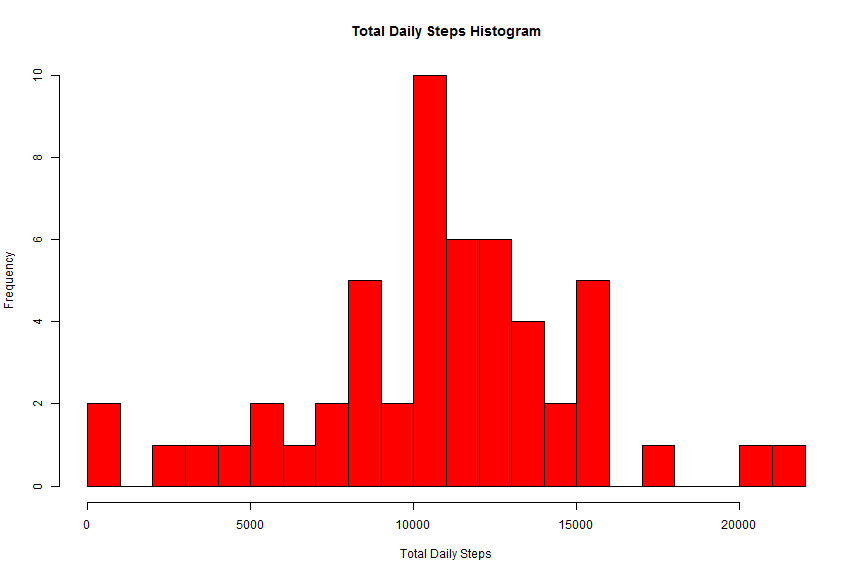
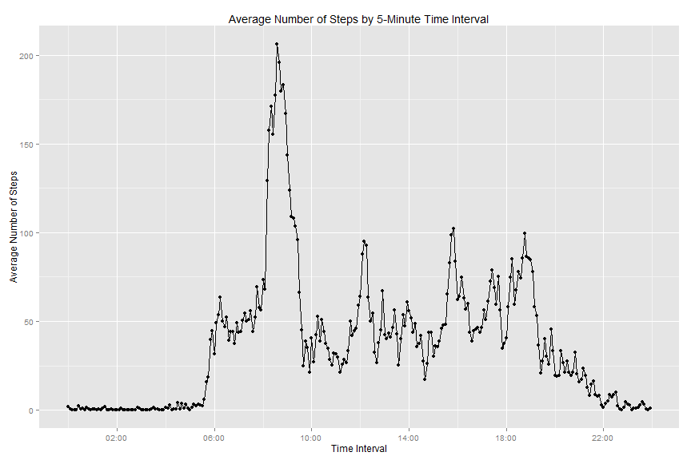
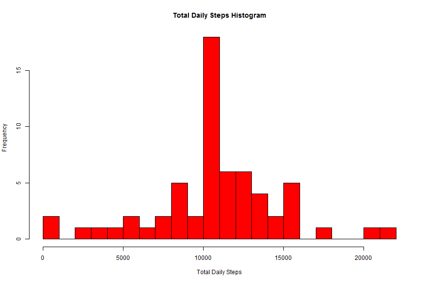
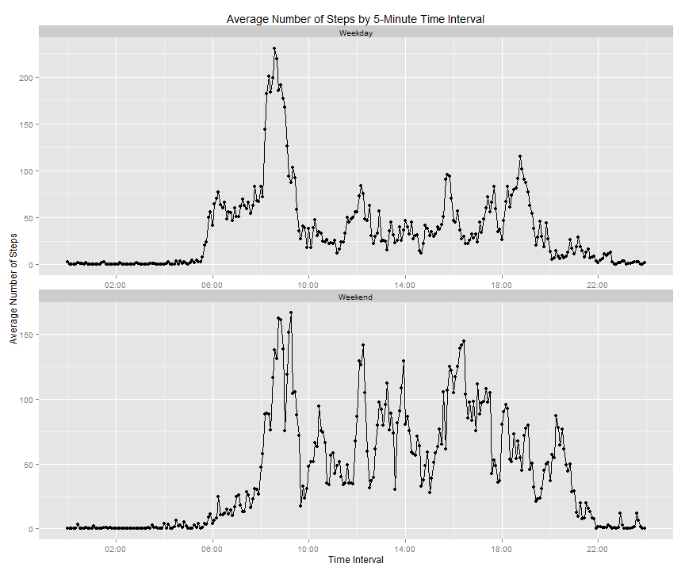

# Reproducible Research: Peer Assessment 1

### Loading and preprocessing the data

1. Make sure that the required data file(s) exist in the current directory.
    
    ```r
    if(!file.exists("activity.csv")){
        if(!file.exists("repdata-data-activity.zip")){
            fileUrl <- 
                "https://d396qusza40orc.cloudfront.net/repdata%2Fdata%2Factivity.zip"
            download.file(fileUrl, destfile = "./repdata-data-activity.zip",
                          mode = "wb")
            unzip("./repdata-data-activity.zip")
        }
        else{
            unzip("./repdata-data-activity.zip")    
        }
    }
    ```

2. Read the data file(s).
    
    ```r
    activityData <- read.csv("./activity.csv", header = TRUE, sep = ",",
                             na.strings = "NA")
    ```

3. Convert interval values to time (HH:MM) format.
    
    ```r
    temp <- mapply(function(x, y) paste0(rep(x, y), collapse = ""), 0, 4 - 
                       nchar(activityData$interval))
    activityData$interval <- paste0(temp, activityData$interval)
    activityData$interval <- format(strptime(activityData$interval,
                                                format="%H%M"), format = "%H:%M")
    ```


### Mean total number of steps taken per day

1. Total number of steps per day.
    
    ```r
    sumData <- aggregate(steps ~ date, data = activityData, FUN = 'sum')
    ```

2. Histogram of total daily steps.
    
    ```r
    hist(sumData$steps, breaks = 20, xlab = "Total Daily Steps",
         main = "Total Daily Steps Histogram", col="red")
    ```
    
     

3. Mean of total number of steps per day.
    
    ```r
    meanDailyTotalSteps <- mean(sumData$steps)
    meanDailyTotalSteps
    ```
    
    ```
    ## [1] 10766.19
    ```

4. Median of total number of steps per day.
    
    ```r
    medianDailyTotalSteps <- median(sumData$steps)
    medianDailyTotalSteps
    ```
    
    ```
    ## [1] 10765
    ```


### Average daily activity pattern

1. Time series plot of the 5-minute interval (x-axis) and the average number of steps taken, averaged across all days (y-axis).
    + Calculate average number of steps by time interval for all days.
    
    ```r
    avgStepsIntData <- aggregate(steps ~ interval, data = activityData, 
                             FUN = 'mean', na.rm = TRUE)
    ```
    + Load the required libraries for plotting.
    
    ```r
    library(ggplot2)
    ```
    
    ```
    ## Use suppressPackageStartupMessages to eliminate package startup messages.
    ```
    
    ```r
    library(scales)
    ```
    + Create a line plot of the average steps by time interval.
    
    ```r
    qplot (as.POSIXct(interval,format="%H:%M"), steps, data = avgStepsIntData, 
           xlab = "Time Interval", ylab = "Average Number of Steps", 
           main = "Average Number of Steps by 5-Minute Time Interval") +
        geom_line() + scale_x_datetime(breaks = date_breaks("4 hour"), 
                                       labels=date_format("%H:%M"))
    ```
    
     

2. Time interval with the highest average number of steps.
    
    ```r
    avgStepsIntData[which.max(avgStepsIntData$steps),1]
    ```
    
    ```
    ## [1] "08:35"
    ```


### Imputing missing values

1. Total number of missing values in the dataset (i.e. the total number of rows with NAs).
    
    ```r
    naSteps <- length(which(is.na(activityData$steps)))
    naSteps
    ```
    
    ```
    ## [1] 2304
    ```

2. Filling missing values in the dataset (using average number of steps by interval values) and creating a new dataset.
    
    ```r
    newActivityData <- merge (x = activityData, y = avgStepsIntData, 
                              by = "interval", all = TRUE)
    newActivityData$steps.x[is.na(newActivityData$steps.x)] <- 
        newActivityData$steps.y[is.na(newActivityData$steps.x)]
    ```

3. Histogram of total daily steps with no missing data.
    
    ```r
    sumData2 <- aggregate(steps.x ~ date, data = newActivityData, FUN = 'sum')
    hist(sumData2$steps.x, breaks = 20, xlab = "Total Daily Steps",
         main = "Total Daily Steps Histogram", col="red")
    ```
    
     

4. Mean of total number of steps per day with no missing values.
    
    ```r
    meanDailyTotalSteps2 <- mean(sumData2$steps.x)
    meanDailyTotalSteps2
    ```
    
    ```
    ## [1] 10766.19
    ```

5. Median of total number of steps per day with no missing values.
    
    ```r
    medianDailyTotalSteps2 <- median(sumData2$steps.x)
    medianDailyTotalSteps2
    ```
    
    ```
    ## [1] 10766.19
    ```

>**Imputing missing values has increased the daily totals for the number of steps
 taken as well as slightly increased the median value of daily total steps. 
 However, the average value of daily total steps has remain unchanged.**


### Differences in activity patterns between weekdays and weekends

1. Creating a factor variable for weekday and weekend.
    
    ```r
    newActivityData$day <- ifelse(weekdays(as.Date(newActivityData$date)) %in%
                                      c("Saturday","Sunday"), "Weekend", "Weekday")
    ```

2. Averaging the number of steps by interval and type of day (i.e. Weekday or 
Weekend).
    
    ```r
    avgStepsIntData2 <- aggregate(steps.x ~ interval + day, data = newActivityData,
                                  FUN = 'mean', na.rm = TRUE)
    ```

3. Panel plot containing a time series plot of the 5-minute interval (x-axis) 
and the average number of steps taken, averaged across all weekday days or 
weekend days (y-axis).
    
    ```r
    qplot (as.POSIXct(interval,format="%H:%M"), steps.x, data = avgStepsIntData2,
           xlab = "Time Interval", ylab = "Average Number of Steps", 
           main = "Average Number of Steps by 5-Minute Time Interval", 
           facets = day ~ .) + geom_line(aes(group = day)) + 
        facet_wrap( ~day, ncol=1, scales = "free") +
        scale_x_datetime(breaks = date_breaks("4 hour"), 
                         labels=date_format("%H:%M"))
    ```
    
     
